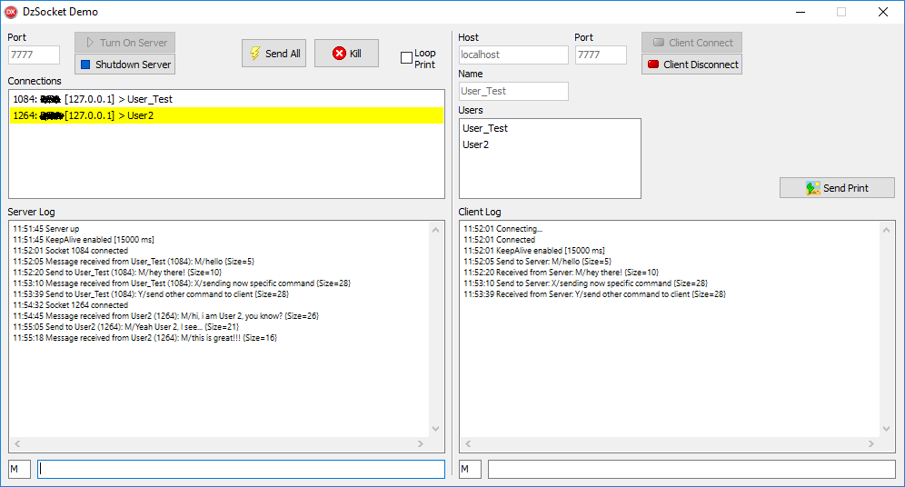

# DzSocket

## Delphi TCP Socket Client and Server communication with Unicode support




- [What's New](#whats-new)
- [Description](#description)
- [Delphi native component differences](#delphi-native-component-differences)
- [Installing](#installing)
- [Server Component](#server-component)
- [Client Component](#client-component)
- [Array data send](#array-data-send)
- [How to send stream](#how-to-send-stream)

## What's New

- 02/01/2021 (Version 2.5)

   - Removed Delphi XE2 from the list of environments as it was never possible to compile in this version.
   - Fixed XE6 conditional directive about JSON, because was incorrectly pointing to XE5.

- 12/18/2020 (Version 2.4)

   - Updated Component Installer app (Fixed call to rsvars.bat when Delphi is installed in a path containing spaces characters).

- 11/28/2020

   - Included new FMX chat demo application.

- 10/31/2020 (Version 2.3)

   - Included Delphi 10.4 auto-install support.

- 10/27/2020 (Version 2.2)

   - Fixed previous Delphi versions (at least on XE2, XE3, XE4 and XE5) package tag. It was causing package compilation error.
   - Fixed to use JSON unit only when Delphi XE6 or higher.

- 10/26/2020 (Version 2.1)

   - Updated CompInstall to version 2.0 (now supports GitHub auto-update)

- 10/09/2020

   - Changed disregard treatment to occur in Send method instead SendAll / SendAllEx (internally call Send method anyway).

- 10/06/2020

   - Implemented treatment to disregard client connection in SendAll / SendAllEx methods from the moment of their disconnection event.

- 09/24/2020

   - Included empty string validation on DataToArray to avoid JSON conversion error.

- 07/16/2020

   - New authentication/authorization support!!!
   - Array data send conversion methods.
   - Removed SendAllOnlyWithData property.

- 07/12/2020

   - Increase reading speed by not change string variable multiple times.

- 05/03/2020

   - Updated CompInstall to version 1.2

- 04/19/2020

   - Fixed Client Error event behavior to occur after internal operations. Possible behavior changing. Check issue #3. :warning:
   - Implemented SendAllOnlyWithData public property.
   - Fixed connection Lookup error to bring OnDisconnect with WasConnected=False.

- 03/31/2019

   - Include support to Unicode characters on commands and messages text

## Description

These components allows you to establish TCP Socket asynchronous communication between computers on LAN network or the Internet.

The DzTCPServer and DzTCPClient uses *TClientSocket* and *TServerSocket* of System.Win.ScktComp unit. These classes are available on Delphi, but is a little difficult to implement because you need to read and write buffer data and there are not many resources available.

The usage is very simple. You gonna need to drop the server component on server-side app and the client component on client-side app and start coding the command messages.

You can do a lot of stuff, like chat app, remote commands app, remote monitoring app, and even send streams like files. The sky is the limit. :wink:

## Delphi native component differences

- **Cache structure**: When you are using Delphi native socket component, If you send multiple messages simultaneously, the recipient may receive the messages grouped or divided, so you need always to deal with this problem. DzSocket controls socket messages automatically, so you always receive one event per message.

- **KeepAlive**: When you establish a socket connection, if one side of connection is lost, the other side will not be communicated until a new message attempts to be send. So you can implement a manual ping, but this will give a lot of unnecessary work. DzSocket has the KeepAlive resource, enabling network native keep-alive protocol.

- **Commands**: The native socket allows you to send string segment, but if you want to send commands and identify this commands in the other side of the connection, you will need to manually implement this. With DzSocket, you have a Char command always available. Ready, fast and easy.

- **Auto Free Data Objects on Server**: The Client object list available on Server component has a Pointer property, allowing you to store information about the client connection, usually using a object. With DzSocket, you don't need to worry about this object destruction. You just need to enable a property to take care of these objects.

- **Enumerator**: The native Server component does not have a enumerator to iterate Client List connections. Using DzSocket, you can simply do a `for .. in` directly on Server component, iterating client list connections.

- **SendAll**: Easily send command to all clients. Besides that, you can use `SendAllEx` to send command to all clients except a specific client connection.

- **Connection Monitor**: There is a Connection Lost event allowing you to know when the connection was closed without the client request.

- **Unicode support**: The Delphi native component does not support sending messages using Unicode strings, unless you write your own code to convert data stream on the both sides. This is really boring and takes time. Using DzSocket you can simply send message text using directly method parameter as string type, so Delphi will consider Unicode characters as WideString by default.

- **Login control**: You can control client authentication/authorization by using simple events and you can send extra data information to control client access to the server.

And much more! :wink:

## Installing

### Auto install

Close Delphi IDE and run **CompInstall.exe** app to auto install component into Delphi.

### Manual install

1. Open **DzSocket** package in Delphi.
2. Ensure **Win32** Platform and **Release** config are selected.
3. Then **Build** and **Install**.
4. If you want to use Win64 platform, select this platform and Build again.
5. Add sub-path Win32\Release to the Library paths at Tools\Options using 32-bit option, and if you have compiled to 64 bit platform, add sub-path Win64\Release using 64-bit option.

Supports Delphi XE3..Delphi 10.4

## Server Component

### Server Properties

`AutoFreeObjs: Boolean` (public)  = If you are using `Data` property of client sockets on server to assign objects, you may enable this option, so the component will take care of object destruction when client socket ends. Remember, if this option is enabled and the Data property of socket is assigned, the component will presume always Data as object.

`EnumeratorOnlyAuth: Boolean` (public) = When using component enumerator `for in`, by-pass clients non authenticated yet.

`KeepAlive: Boolean` = Allow enable KeepAlive socket native resource. This will send a keep-alive signal using KeepAliveInterval property.

`KeepAliveInterval: Integer` = Specify the KeepAlive interval in milliseconds (default 15000 / *15 seconds*).

`Port: Word` = Specify the Server listen TCP Port. This property is required to start server socket.

`Connection[Index: Integer]: TDzSocket` (public) = Returns the TDzSocket client connection object by Index.

`Count: Integer` (public) = Returns the client connections list count.

### Server Events

```delphi
procedure OnClientConnect(Sender: TObject; Socket: TDzSocket);
```

This event is triggered when a client connects to the server. The `Socket` parameter is the client socket.

```delphi
procedure OnClientDisconnect(Sender: TObject; Socket: TDzSocket);
```

This event is triggered when a client disconnects from the server. The `Socket` parameter is the client socket.

```delphi
procedure OnClientError(Sender: TObject; Socket: TDzSocket;
  const Event: TErrorEvent; const ErrorCode: Integer; const ErrorMsg: string);
```

This event is triggered when occurs an error on a client connection. The `Socket` parameter is the client socket.

```delphi
procedure OnClientRead(Sender: TObject; Socket: TDzSocket;
  const Cmd: Char; const A: string);
```

This event is triggered when a client sends a message to the server. The `Socket` parameter is the client socket.

```delphi
procedure OnClientLoginCheck(Sender: TObject; Socket: TDzSocket; var Accept: Boolean;
  const RequestData: String; var ResponseData: String);
```

This event is triggered when a client has just connected to the server. If at the client side, the `OnLoginRequest` is handled, the data information sent will be receiver here into the `RequestData` parameter.
You can change the `Accept` parameter (initial default value is True) to accept or reject client connection. Besides that, you can use the `ResponseData` parameter to send to the client some data information. The accepted flag and data information will be receiver by the client at `OnLoginResponse` event.
If the `Accept` parameter remains True, then socket `Auth` property will be set to True. Otherwise the client connection will be dropped by the server.

```delphi
procedure OnClientLoginSuccess(Sender: TObject; Socket: TDzSocket);
```

This event is triggered right after a client is authorized into the server. Even if you are not using login events, remember: only after the client is authorized into the server, then the client can send messages. Otherwise the server will ignore any client messages.

### Server Methods

```delphi
procedure Open;
```

Turn On the server listening socket port.

```delphi
procedure Close;
```

Turn Off the server listening socket port.

```delphi
procedure Lock;
procedure Unlock;
```

Use these methods to iterate the Connections list (thread-safe), because a connection may be closed when you are iterating the connection list.

Example:

```delphi
var CSock: TDzSocket;
begin
  Server.Lock;
  try
    for CSock in Server do
    begin
      //...
    end;
  finally
    Server.Unlock;
  end;
end;
```

> Also, the TDzTCPServer component has a default enumerator pointing to the Connections List, resulting in a TDzSocket object. So you can iterate the connection list using a `for .. in` statement, just like the previous example.

```delphi
procedure Send(Socket: TDzSocket; const Cmd: Char; const A: String = '');
```

Sends commands and messages to a client socket specified by `Socket` parameter. You should use `Cmd` parameter to specify a command character, that will be received by the client. The `A` parameter is optional and allows you to specify a message text.

```delphi
procedure SendAll(const Cmd: Char; const A: String = '');
```

Send a message to all authenticated clients.

```delphi
procedure SendAllEx(Exclude: TDzSocket; const Cmd: Char; const A: String = '');
```

Send a message to all authenticated clients, except to the client specified by `Exclude` parameter.

```delphi
function FindSocketHandle(const ID: TSocket): TDzSocket;
```

Returns the TDzSocket object by Socket Handle ID.

```delphi
function GetAuthConnections: Integer;
```

Retrieves only authenticated connections count.

## Client Component

### Client Properties

`KeepAlive: Boolean` = Allow enable KeepAlive socket native resource. This will send a keep-alive signal using KeepAliveInterval property.

`KeepAliveInterval: Integer` = Specify the KeepAlive interval in milliseconds (default 15000 / *15 seconds*).

`Host: String` = Specify the IP or Host Name (DNS) to connect to the server. This property is required to connect to the server socket.

`Port: Word` = Specify the Client connection TCP Port, which the server is listening or the port is mapped. This property is required to connect to the server socket.

`Connected: Boolean` (public) = Returns true if the connection is established.

`SocketHandle: TSocket` (public) = Returns the Socket Handle ID of the connection.

### Client Events

```delphi
procedure OnConnect(Sender: TObject; Socket: TDzSocket);
```

This event is triggered when the client establish the connection to the server.

```delphi
procedure OnConnectionLost(Sender: TObject; Socket: TDzSocket);
```

This event is triggered when the connection is lost between client and server. This will occur if the client detects that the connection was closed without a disconnect command by client itself.

```delphi
procedure OnDisconnect(Sender: TObject; Socket: TDzSocket;
  const WasConnected: Boolean);
```

This event is triggered when the client disconnects from the server, even if connection is lost. The `WasConnected` allows you to know if the OnDisconnect event came from a established connection, because this event will be fired even if you are trying to connect and the connection is not successful established.

```delphi
procedure OnError(Sender: TObject; Socket: TDzSocket;
  const Event: TErrorEvent; const ErrorCode: Integer; const ErrorMsg: string);
```

This event is triggered when occurs an error on the client connection. It's always recommended to set this event, otherwise the component will raise uncontrolled asynchronous errors.

```delphi
procedure OnRead(Sender: TObject; Socket: TDzSocket;
  const Cmd: Char; const A: string);
```

This event is triggered when the client receives a message from the server.

```delphi
procedure OnLoginRequest(Sender: TObject; Socket: TDzSocket; var Data: String);
```

This event is triggered right after client connects to the server. It means server is requesting login data information, so it can check this data and choose accept or drop the client connection.
You should fill `Data` parameter if you want to handle this information on the server.

```delphi
procedure OnLoginResponse(Sender: TObject; Socket: TDzSocket; Accepted: Boolean; const Data: String)
```

This event is triggered when server accepts or rejects the client connection. You can check this result into `Accepted` parameter, and the server may send to the client some data information into `Data` parameter.

### Client Methods

```delphi
procedure Connect;
```

Connects to the server.

```delphi
procedure Disconnect;
```

Disconnects from the server.

```delphi
procedure Send(const Cmd: Char; const A: String = '');
```

Sends commands and messages to the server. You should use `Cmd` parameter to specify a command character, that will be received by the server. The `A` parameter is optional and allows you to specify a message text.

> Important: The server won't receive messages while client still not authenticated, even if it is already connected.

## Array data send

**Only available on Delphi XE6 or higher**

When you are using `Send` method from Server or Client socket, there is a `String` parameter allowing you to send data.
There are two global methods you can use to send multiple data at one time:

```delphi
type TMsgArray = TArray<Variant>;
function ArrayToData(const Fields: TMsgArray): String;
function DataToArray(const Data: String): TMsgArray;
```

**Sender:**
```delphi
var
  I: Integer;
  S: String;
begin
  DzTCPClientTest.Send('M', ArrayToData([I, S]));
end;
```

**Receiver:**
```delphi
procedure DzTCPServerTestClientRead(Sender: TObject; Socket: TDzSocket;
  const Cmd: Char; const A: string);
var MsgArray: TMsgArray;
begin
  MsgArray := DataToArray(A);  
  ShowMessage(Format('Number = %d / String = %s', [MsgArray[0], MsgArray[1]]));
end;
```

> The conversion functions internally use JSON to ensure parts characters escape to ensure pack/unpack arrays without change of content. So, you don't need to worry about content of variant type parts.

## How to send stream

Please check the demo application and look the **Send Print** command to know how to send and receive data stream, and also using compression to increase communication speed. :wink:
